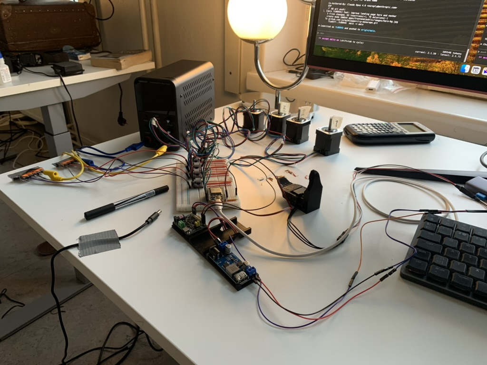
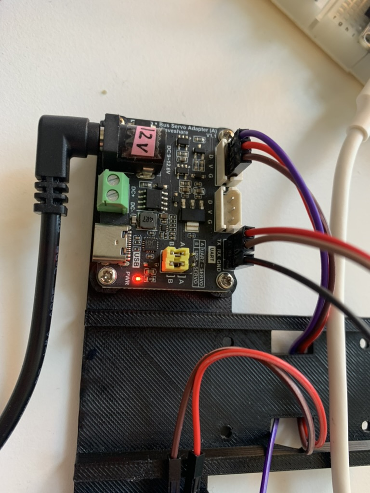

# FR8 Delta Robot Controller

A delta robot with a linear gantry axis, controlled by an ESP32 running custom firmware and orchestrated from Python over 1 Mbaud serial.

The system picks objects using a Dynamixel XL330 gripper, positions them with the 3-axis delta mechanism, and translates along an 800 mm GT2 belt-driven gantry rail.



## Project Structure

```
delta/
├── firmware/                          ← ESP32 PlatformIO project
│   ├── platformio.ini
│   ├── include/
│   │   ├── config.h                   ← Pin maps, motor params, joint limits
│   │   ├── motors.h                   ← Stepper motor management
│   │   ├── gripper.h                  ← Dynamixel XL330 gripper
│   │   └── protocol.h                ← Serial command parser
│   └── src/
│       ├── main.cpp                   ← Setup + loop (30 lines)
│       ├── motors.cpp
│       ├── gripper.cpp
│       └── protocol.cpp
├── python/                            ← Host-side control (uv project)
│   ├── delta_robot.py                 ← Serial interface to ESP32
│   ├── delta_kinematics.py            ← Inverse kinematics solver
│   ├── web_controller.py              ← Flask web dashboard
│   ├── dynamixel_arm.py               ← Direct Dynamixel control (legacy)
│   ├── scripts/
│   │   ├── workspace_analysis.py      ← Compute + visualise reachable workspace
│   │   └── calibration.py             ← Trace a calibration square
│   └── templates/                     ← Web UI HTML
├── arduino/                           ← Legacy Arduino Uno sketch (replaced by firmware/)
└── docs/
    ├── bench-setup.png
    └── waveshare-adapter.png
```

## Architecture

```
Python (host)                          ESP32 (firmware)
┌──────────────────────┐               ┌──────────────────────┐
│  delta_kinematics.py │  IK: XYZ→θ   │                      │
│  delta_robot.py      │──── serial ──→│  protocol.cpp        │
│  web_controller.py   │  1 Mbaud USB  │  motors.cpp          │
│  scripts/            │←── OK/DONE ───│  gripper.cpp         │
└──────────────────────┘               └──────┬───────────────┘
                                              │
                              ┌───────────────┼───────────────┐
                              │               │               │
                         3× DRV8825      1× DRV8825     Waveshare
                         (delta arms)    (gantry)       Servo Adapter
                              │               │               │
                         3× NEMA 17      1× NEMA 17     Dynamixel
                                                        XL330 gripper
```

**Python** handles inverse kinematics, trajectory planning, and orchestration.
**ESP32** handles real-time motor stepping, gripper control, joint-limit enforcement, and motion-complete detection.

## Hardware

| Component | Spec |
| --------- | ---- |
| Delta motors | 3× 17HS19-2004S1 — NEMA 17, 200 steps/rev, 2 A |
| Gantry motor | 1× 17HS19-2004S1 — NEMA 17, GT2 belt + 20T pulley |
| Drivers | 4× DRV8825 — 1/32 microstepping, 2.5 A max |
| Controller | ESP32 Dev Module (240 MHz, 320 KB RAM) |
| Gripper | Dynamixel XL330 via Waveshare Bus Servo Adapter v1.1 |
| Power | 12–24 V supply, ≥ 8 A (4 motors × 2 A) |



## Wiring

### ESP32 → DRV8825 Pin Map

| Signal | Delta M1 | Delta M2 | Delta M3 | Gantry M4 |
| ------ | -------- | -------- | -------- | --------- |
| STEP   | GPIO 12  | GPIO 14  | GPIO 26  | GPIO 32   |
| DIR    | GPIO 13  | GPIO 27  | GPIO 25  | GPIO 33   |

### ESP32 → Waveshare Servo Adapter (UART)

| Signal | ESP32 Pin |
| ------ | --------- |
| TX     | GPIO 17 (TX2) |
| RX     | GPIO 16 (RX2) |
| GND    | GND (common) |

The Waveshare v1.1 adapter handles direction control automatically (`DXL_DIR = -1`).

### DRV8825 → Power & Motor

```
VMOT ──── +12–24 V (motor supply)
GND  ──── Supply GND ─── ESP32 GND  (common ground!)
B2, B1 ── Motor coil B
A2, A1 ── Motor coil A
RESET ─── SLEEP (tie together, pull HIGH)
```

> Place a 100 µF electrolytic capacitor across VMOT and GND on each DRV8825.

### Current Limit

```
Vref = I_max × 0.5
```

For the 17HS19-2004S1 at 2 A: **Vref ≈ 1.0 V**.

### Microstepping

Currently using **1/32 microstepping** (M0=H, M1=H, M2=H). All parameters are derived in `firmware/include/config.h`:

| Parameter | Value | Derivation |
| --------- | ----- | ---------- |
| Delta steps/rev | 19 200 | 200 × 32 × 3 (3:1 pulley) |
| Delta steps/degree | 53.33 | 19 200 / 360 |
| Gantry steps/rev | 6 400 | 200 × 32 |
| Gantry steps/mm | 160 | 6 400 / 40 mm (20T GT2) |

## Software Setup

### Firmware (ESP32)

Requires [PlatformIO](https://platformio.org/).

```bash
cd firmware
pio run -e esp32 --target upload
pio device monitor -b 1000000          # serial monitor for debugging
```

### Python

Requires [uv](https://docs.astral.sh/uv/).

```bash
cd python
uv sync
```

## Usage

### Quick Test (serial monitor)

Open a serial monitor at 1 000 000 baud. You should see:

```
FR8 Delta v1.0.0
Motors OK
Gripper OK
READY
```

Then type commands directly:

```
PING              → PONG
M 10 10 10        → OK  ...  DONE
POS               → POS:10.00,10.00,10.00,0.00
G 200             → OK  ...  DONE
GRIP CLOSE        → OK
TELEM             → TELEM:d1=10.00,d2=10.00,d3=10.00,gx=200.00,...
```

### Python Control

```python
from delta_robot import DeltaRobot
from delta_kinematics import DeltaKinematics

dk = DeltaKinematics(upper_arm=150, lower_arm=271, Fd=36.7, Ed=80)

with DeltaRobot("/dev/tty.usbserial-0001") as robot:
    # Move delta to joint angles
    robot.move_delta(10, 10, 10)
    robot.wait_until_done()

    # IK-driven Cartesian move
    a1, a2, a3 = dk.inverse(50, 0, -200)
    robot.move_delta(a1, a2, a3)
    robot.wait_until_done()

    # Gantry + gripper
    robot.move_gantry(400)
    robot.wait_until_done()
    robot.grip_close()

    # Read telemetry
    t = robot.get_telemetry()
    print(f"Gripper temp: {t.dxl_temp}°C")
```

### Workspace Analysis

Compute the reachable workspace and find safe operating envelopes:

```bash
cd python
uv run python scripts/workspace_analysis.py              # terminal table
uv run python scripts/workspace_analysis.py --plot        # with matplotlib plots
uv run python scripts/workspace_analysis.py --save ws.png # save to file
```

## Serial Protocol Reference

All commands are newline-terminated text at 1 Mbaud.

### Motion Commands

| Command | Example | Description |
| ------- | ------- | ----------- |
| `M a1 a2 a3` | `M 15.0 -10.0 22.8` | Move delta to angles (degrees) |
| `G x` | `G 400.0` | Move gantry to X position (mm) |
| `MG a1 a2 a3 x` | `MG 15 -10 22.8 400` | Move delta + gantry simultaneously |
| `GRIP OPEN` | | Open gripper |
| `GRIP CLOSE` | | Close gripper |
| `GRIP pos` | `GRIP 2500` | Set gripper to raw position (0–4095) |
| `HOME` | | Move all axes to current software zero |
| `GANTRY_HOME` | | Home gantry to endstop (move to limit, set 0, back off 2 mm) |
| `STOP` | | Decelerate to stop |
| `ESTOP` | | Immediate hard stop |
| `ZERO` | | Declare current position as origin |

### Configuration Commands

| Command | Example | Description |
| ------- | ------- | ----------- |
| `SPD val` | `SPD 10000` | Set delta max speed (steps/s) |
| `ACC val` | `ACC 5000` | Set delta acceleration (steps/s²) |
| `GSPD val` | `GSPD 10000` | Set gantry max speed (steps/s) |
| `GACC val` | `GACC 5000` | Set gantry acceleration (steps/s²) |

### Query Commands

| Command | Response | Description |
| ------- | -------- | ----------- |
| `POS` | `POS:10.00,10.00,10.00,200.00` | Positions (d1°, d2°, d3°, gantry mm) |
| `STATUS` | `STATUS:IDLE` or `STATUS:MOVING` | Motion state |
| `TELEM` | `TELEM:d1=...,dxl_temp=42,...` | Full telemetry (key=value pairs) |
| `PING` | `PONG` | Heartbeat |

### Response Conventions

| Response | Meaning |
| -------- | ------- |
| `OK` | Command accepted, motion started |
| `DONE` | All motors reached their targets |
| `ERR:<message>` | Error (e.g. `ERR:ANGLE_LIMIT`) |

## Robot Geometry

Default inverse kinematics parameters (configured in `delta_kinematics.py` and `config.h`):

| Parameter | Value | Description |
| --------- | ----- | ----------- |
| `upper_arm` (L) | 150 mm | Shoulder-to-elbow length |
| `lower_arm` (l) | 271 mm | Elbow-to-effector-joint length |
| `Fd` | 36.7 mm | Base joint offset from centre |
| `Ed` | 80.0 mm | Effector joint offset from centre |

Coordinate system: origin at base centre, **Z points down** (workspace is at negative Z).

### Homing

- **Gantry:** `GANTRY_HOME` moves the gantry toward the endstop (GPIO 34) until the switch is pressed, sets position to 0, then backs off 2 mm. Valid range is 0–500 mm from the endstop. Gantry motor “forward” (anticlockwise) increases position.
- **Delta:** Home is the arms at their highest position (mechanical limit). Set the home angles in `python/coordinates.py` after manually moving to the limit and reading `POS`; then use `homing.run_homing_sequence()` or `robot.home_full()`.
- **Gripper:** Home = open (Dynamixel position in `coordinates.GRIPPER_HOME_POSITION`).

See `python/coordinates.py` for the unified coordinate system and `python/homing.py` for the homing API.

### Joint Limits

| Axis | Min | Max |
| ---- | --- | --- |
| Delta arms | -70° | +70° |
| Gantry | 0 mm (endstop) | 500 mm |

### Workspace (at default joint limits)

| Z height | Inscribed radius | Max safe square |
| -------- | ---------------- | --------------- |
| -150 mm | 263 mm | 372 × 372 mm |
| -200 mm (pick zone) | 256 mm | 363 × 363 mm |
| -250 mm | 240 mm | 340 × 340 mm |
| -300 mm | 211 mm | 299 × 299 mm |

Run `scripts/workspace_analysis.py` for the full table.

## Development

### Flashing

```bash
cd firmware && pio run -e esp32 --target upload
```

### Monitoring

```bash
cd firmware && pio device monitor -b 1000000
```

### Python Environment

```bash
cd python && uv sync && uv run python <script>
```
